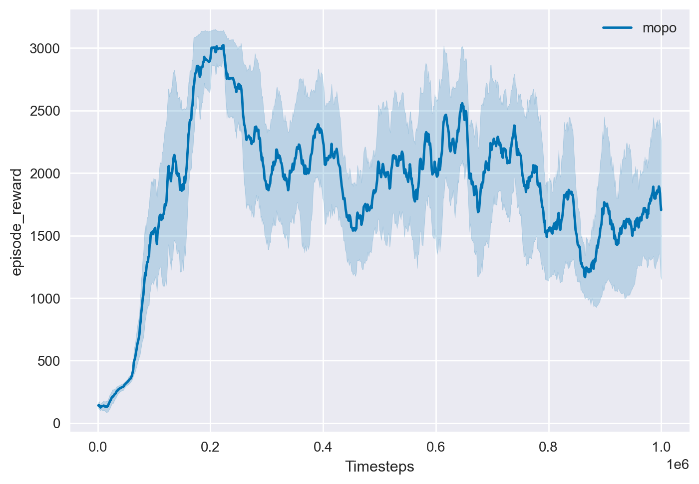
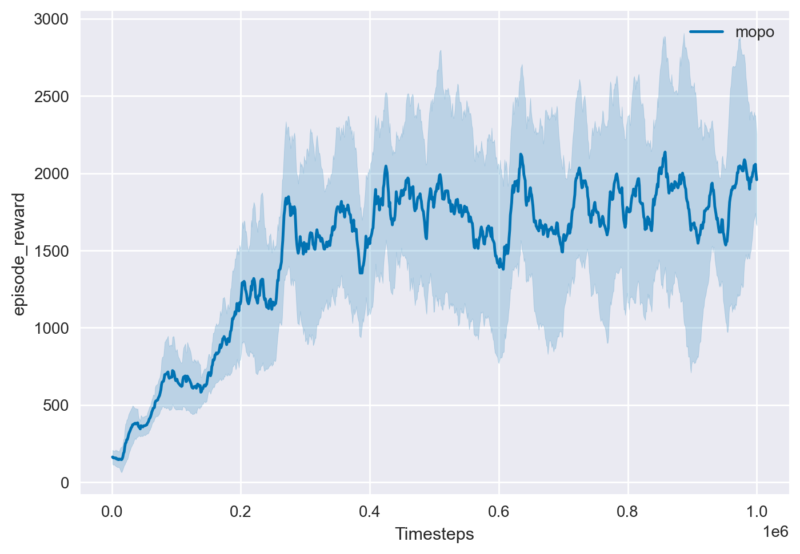
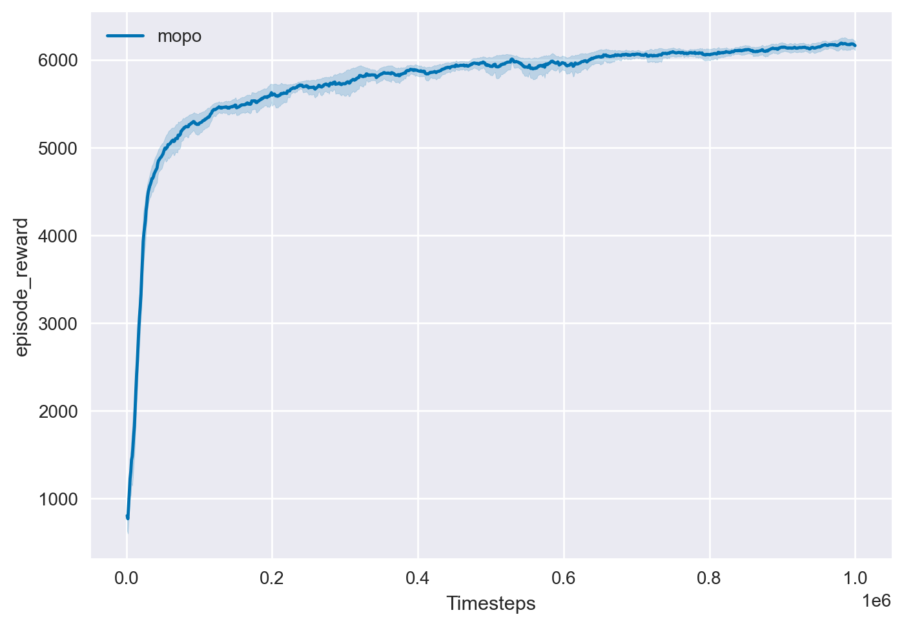

# Overview

This is a re-implementation of the offline model-based RL algorithm MOPO all by pytorch **(including dynamics and mopo algo)** as described in the following paper: [MOPO: Model-based Offline Policy Optimization](https://arxiv.org/pdf/2005.13239.pdf)

The performance of model-based RL algorithm greatly depends on the implementation of the ensemble dynamics model and we find that the performance of pytorch ensemble models implemented by third parties will be reduced compared with the official implementation. To this end, we reuse the official tensorflow version ensemble model. Don't worry, the implementation of the ensemble model is separate from our core code, which will not affect the simplicity of pytorch.

# Dependencies

- MuJoCo 2.0
- Gym 0.22.0
- d4rl
- PyTorch 1.8+

# Usage


## Abiomed Implementation:

```
python mopo.py --task Abiomed-v0 --reward-penalty-coef 1e-3 --model_path 'saved_models"
```

## Baselines

BC and BCQ, and MBPO implementations. We want to run for the following list of baselines:

- halfcheetah-random-v0
- halfcheetah-expert-v0
- walker2d-random-v0
- walker2d-expert-v0

```
python algo/bc.py --task halfcheetah-random-v0 --seeds 1 2 3 --model-dir saved_models/BC --epochs 25 --device_id 5

python algo/bcq.py --task halfcheetah-random-v0 --seeds 1 2 3 --model-dir saved_models/BCQ  --device_id 5
```

For MBPO (change device to use the most available GPU):
```
python algo/mbpo.py --task "halfcheetah-random-v0" --rollout-length 5 --reward-penalty-coef 0 --epoch 1 --seeds 1 2 3 --device cuda:5 
```

For MOPO (the difference is only `reward-penalty-coef` value):

```
python algo/mbpo.py --task "halfcheetah-random-v0" --rollout-length 5 --reward-penalty-coef 1.0 --epoch 1 --seeds 1 2 3 --device cuda:5 
```

## MOPO - Train

```
# for hopper-medium-replay-v0 task
python train.py --task "hopper-medium-replay-v0" --rollout-length 5 --reward-penalty-coef 1.0 

# for walker2d-medium-replay-v0 task
python train.py --task "walker2d-random-v2" --rollout-length 1 --reward-penalty-coef 1.0 

# for halfcheetah-medium-v0 task
python train.py --task "halfcheetah-random-v0" --rollout-length 5 --reward-penalty-coef 1.0 

```
To train the world model, train.py() -> pretrained = False
To train the dynamics model, comment out ```dynamics_model.load_model()``` and decomment ```trainer.train_dynamics()```
Change the path of the dynamics model in model.transition_model.load_model()


After training with different seeds;


## Test
```
python test.py --task "halfcheetah-random-v2" --eval_episodes 1e6
python test.py --task "walker2d-random-v2" --eval_episodes 1e6

```

For different mujoco tasks, the only differences of hyperparameters are "rollout-length" and "reward-penalty-coef". Please see the original paper for other tasks' hyperparameters.

## Plot

```
python plotter.py --root-dir "log" --task "hopper-medium-replay-v0"
```
## Scoring

```scorer.py``` outputs the average normalized and unnormalized returns. task parameter is where the test results are saved.

```
python scorer.py --task "half-cheetah-v2"
```

## Normalizing

```normalizer.py``` outputs the mean and variance of the normalized mean reward for each run across the different datasets and methods. To use this script, provide the path to the results csv (arg 1) and the corresponding environment name (arg 2).

Usage:
```
python normalizer.py <csv_path> <env_name>
```

Example:

```
python normalizer.py results/halfcheetah-expert-v0/bc/bc_results_0412_053158.csv halfcheetah-expert-v0
```

# Reproduced results
All experiments were run for 2 random seeds each and learning curves are smoothed by averaging over a window of 10 epochs.

### hopper-medium-replay-v0



### walker2d-medium-replay-v0



### halfcheetah-medium-replay-v0



# Reference

- Official tensorflow implementation: [https://github.com/tianheyu927/mopo](https://github.com/tianheyu927/mopo)
